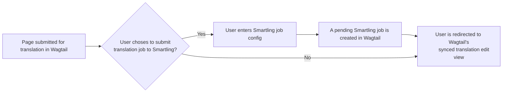
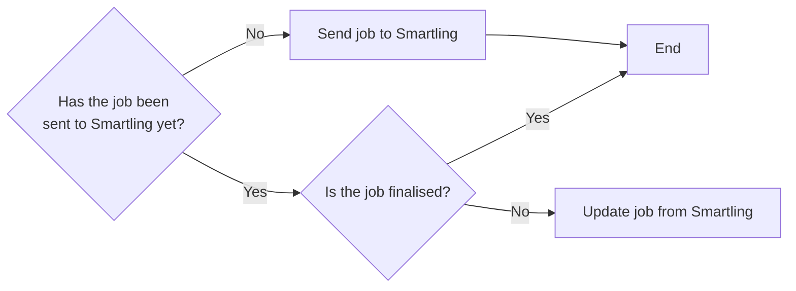

# Wagtail Localize Smartling

[](https://opensource.org/licenses/MPL-2.0)
[](https://badge.fury.io/py/wagtail-localize-smartling)
[](https://github.com/mozilla/wagtail-localize-smartling/actions/workflows/test.yml)

An extension for [Wagtail Localize](https://wagtail-localize.org/stable/) that
integrates with the Smartling translation platform.

## Links

- [Documentation](https://github.com/mozilla/wagtail-localize-smartling/blob/main/README.md)
- [Changelog](https://github.com/mozilla/wagtail-localize-smartling/blob/main/CHANGELOG.md)
- [Contributing](https://github.com/mozilla/wagtail-localize-smartling/blob/main/CONTRIBUTING.md)
- [Security](https://github.com/mozilla/wagtail-localize-smartling/security)
- [Smartling API documentation](https://api-reference.smartling.com/)

## Supported versions

- Python 3.8+
- Django 4.2+
- Wagtail 6.1+

## Installation

1. Install the package from PyPI:

    ```sh
    python -m pip install wagtail-localize-smartling
    ```

2. Add `"wagtail_localize_smartling"` to `INSTALLED_APPS` in your Django
    settings. Make sure it's before `"wagtail_localize"` and
    `"wagtail_localize.locales"`:

    ```python
    INSTALLED_APPS = [
        ...
        "wagtail_localize_smartling",
        "wagtail_localize",
        "wagtail_localize.locales",
        ...
    ]
    ```

3. Configure the plugin in your Django settings:

   ```python
    WAGTAIL_LOCALIZE_SMARTLING = {
        # Required settings (get these from "Account settings" > "API" in the Smartling dashboard)
        "PROJECT_ID": "<project_id>",
        "USER_IDENTIFIER": "<user_identifier>",
        "USER_SECRET": "<user_secret>",
        # Optional settings and their default values
        "REQUIRED": False,  # Set this to True to always send translations to Smartling
        "ENVIRONMENT": "production",  # Set this to "staging" to use Smartling's staging API
        "API_TIMEOUT_SECONDS": 5.0,  # Timeout in seconds for requests to the Smartling API
    }
    ```

    If your project's locales do not match those in Smartling (e.g. `ro` in your
    project, `ro-RO` in Smartling), then you can provide a Wagtail locale ID to
    Smartling locale ID mapping via the `LOCALE_TO_SMARTLING_LOCALE` setting:

    ```python
    WAGTAIL_LOCALIZE_SMARTLING = {
        "LOCALE_TO_SMARTLING_LOCALE": {
            "ro": "ro-RO"
        }
    }
    ```

    ... or you can specify a callable or a dotted path to a callable in the
    `LOCALE_MAPPING_CALLBACK` setting:

    ```python
    def map_project_locale_to_smartling(locale: str) -> str:
        if locale == "ro":
            return "ro-RO"
        return locale


    WAGTAIL_LOCALIZE_SMARTLING = {
        # ...
        "LOCALE_MAPPING_CALLBACK": "settings.map_project_locale_to_smartling"
    }
    ```

    The callback receives a `WAGTAIL_CONTENT_LANGUAGES` local code string and is
    expected to return a valid mapped locale ID (or the original locale ID).

    Note that by default, when syncing translations the project will attempt to
    reformat a mixed-case, Smartling-style language code (e.g. `zh-CN`) into a
    Django-style all-lowercase code (e.g. `zh-cn`). Depending on how language
    codes are set up in your project, this behaviour may not be appropriate. You
    can disable it by settings the `REFORMAT_LANGUAGE_CODES` setting to `False`
    (the default is `True`):

    ```python
    WAGTAIL_LOCALIZE_SMARTLING = {
        # ...
        "REFORMAT_LANGUAGE_CODES": False
    }

    ```

4. Run migrations:

    ```sh
    ./manage.py migrate
    ```

## Setup

### Smartling project setup

For the plugin to work with a Smartling project, the Django/Wagtail internationalization- and localization-related settings must be compatible with the project's language settings:

- Only Wagtail content authored in the same language as the Smartling project's source language can be translated.
- Ideally, the language tags in [`WAGTAIL_CONTENT_LANGUAGES`](https://docs.wagtail.org/en/stable/reference/settings.html#wagtail-content-languages) should be the exact, case-insensitive matches for the Smartling projects target locales. For example, if your Smartling project targets `fr-FR`, then you must have `"fr-fr"` in your `WAGTAIL_CONTENT_LANGUAGES`, not just `"fr"`.
  However, if that is not possible, use the `LOCALE_TO_SMARTLING_LOCALE` or `LOCALE_MAPPING_CALLBACK` settings to map your Wagtail language codes to the Smartling language codes.

### Synchronization

The plugin provides a `sync_smartling` management command that:

- Creates jobs in Smartling for new content that's awaiting translation
- Checks the status of pending translation jobs
- Downloads and applies translations for completed jobs

This command should be set to run periodically via `cron` or similiar:

```sh
./manage.py sync_smartling
```

We recommend running this regularly, around once every 10 minutes.

### Callbacks

As well as the `sync_smartling` management command, the plugin sets the `callbackUrl` field on the Smartling jobs it creates to the URL of webhook handler view. This handler will proactively download and apply translations from completed jobs without waiting for the next `sync_smartling` run. This URL is based on the `WAGTAILADMIN_BASE_URL` setting, so it's important that's set and accessible from the internet.

> [!WARNING]
> Callbacks should not be relied on as the only method for downloading translations. Always make sure the `sync_smartling` command is run regularly to ensure your translations are up-to-date.

## Usage

### Submitting new content for translation
<!-- TODO -->

### Updating translations
<!-- TODO -->

## How it works
<!-- TODO -->

## Workflow

<!-- TODO make sure this is fleshed out properly -->

### Submitting pages for Smartling translation



### Smartling sync

`django-admin sync_smartling`, the below flowchart describes the logic run for each job



## Signals

This app provides a single `wagtail_localize.signals.translation_imported`
signal that is sent when translation are imported from Smartling.

Signal kwargs:

- `sender`: The `wagtail_localize_smartling.models.Job` class
- `instance`: The `Job` instance for which translation are being imported
- `translation`: The `wagtail_localize.models.Translation` instance the translations are being imported to.
  Use `translation.get_target_instance()` to get the model instance that the translation is for (e.g. a page or snippet)

## Cutting a new release

1. Bump the version in <https://github.com/mozilla/wagtail-localize-smartling/blob/main/src/wagtail_localize_smartling/__init__.py>
2. Update CHANGELOG.md
3. Commit and land the changes in main (via a PR, or committing to main if you're _sure_ this won't cause clashes)
4. Tag the release as `vX.Y.Z` on `main` – or make a tag via the GH UI in Step 6. (Remember to push up the new tag if you made it locally, with `git push --tags`)
5. Add a new Release via <https://github.com/mozilla/wagtail-localize-smartling/releases>
6. Select (or create) the new tag, add the title and description
7. Ensure the new Release is marked as latest (see checkboxes below the Release description)
8. Publish the new Release within GitHub - automation will take of the rest and push it up to PyPI
