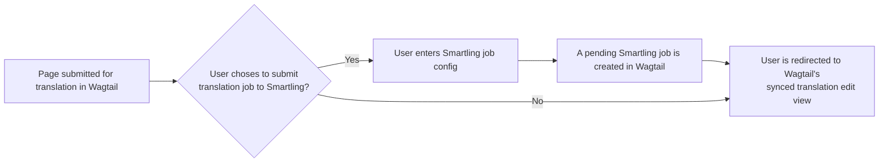
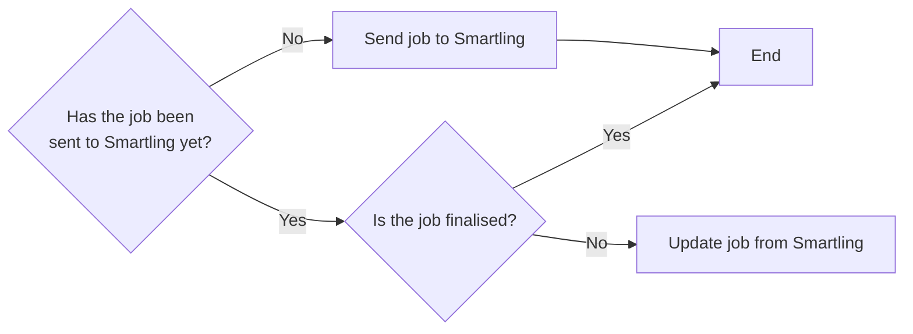

# Wagtail Localize Smartling

An extension for wagtail-localize that integrates with the Smartling translation platform.

[](https://opensource.org/licenses/BSD-3-Clause)
[](https://badge.fury.io/py/wagtail-localize-smartling)
[](https://github.com/bcdickinson/wagtail-localize-smartling/actions/workflows/test.yml)

## Links

- [Documentation](https://github.com/bcdickinson/wagtail-localize-smartling/blob/main/README.md)
- [Changelog](https://github.com/bcdickinson/wagtail-localize-smartling/blob/main/CHANGELOG.md)
- [Contributing](https://github.com/bcdickinson/wagtail-localize-smartling/blob/main/CONTRIBUTING.md)
- [Discussions](https://github.com/bcdickinson/wagtail-localize-smartling/discussions)
- [Security](https://github.com/bcdickinson/wagtail-localize-smartling/security)

## Supported versions

- Python 3.8+
- Django 4.2+
- Wagtail 5.2+

## Installation

- `python -m pip install wagtail-localize-smartling`
- ...


## Usage

<!--

TODO:
- Document settings
- Document requirements for setting up the Smartling project:
  - Country and region codes must match exactly between
    WAGTAIL_CONTENT_LANGUAGES and the Smartling settings (except for case, this is
    accounted for)
- Need to set up scheduled command

-->

## Workflow

<!-- TODO make sure this is fleshed out properly -->

### Submitting pages for Smartling translation



### Smartling sync

`django-admin sync_smartling`, the below flowchart describes the logic run for each job


## Signals

<!-- TODO -->
- `job_config_created` to be used for asynchronous scheduling of creation of jobs
- `translation_imported` to be

## Contributing

### Install

To make changes to this project, first clone this repository:

```sh
git clone https://github.com/bcdickinson/wagtail-localize-smartling.git
cd wagtail-localize-smartling
```

With your preferred virtualenv activated, install testing dependencies:

#### Using pip

```sh
python -m pip install --upgrade pip>=21.3
python -m pip install -e '.[test]' -U
```

#### Using flit

```sh
python -m pip install flit
flit install
```

### pre-commit

Note that this project uses [pre-commit](https://github.com/pre-commit/pre-commit).
It is included in the project testing requirements. To set up locally:

```shell
# go to the project directory
$ cd wagtail-localize-smartling
# initialize pre-commit
$ pre-commit install

# Optional, run all checks once for this, then the checks will run only on the changed files
$ git ls-files --others --cached --exclude-standard | xargs pre-commit run --files
```

### How to run tests

Now you can run tests as shown below:

```sh
tox
```

or, you can run them for a specific environment `tox -e python3.11-django4.2-wagtail5.1` or specific test
`tox -e python3.11-django4.2-wagtail5.1-sqlite wagtail-localize-smartling.tests.test_file.TestClass.test_method`


### Interative user

To run the test app interactively, use `./testmanage.py` instead of `./manage.py` and then run commands as you would for a normal Django project (e.g. `./testmanage.py runserver`, `./testmanage.py createsuperuser`, etc.).
