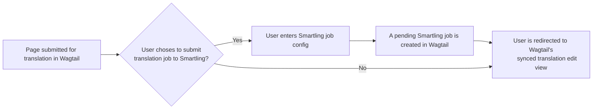
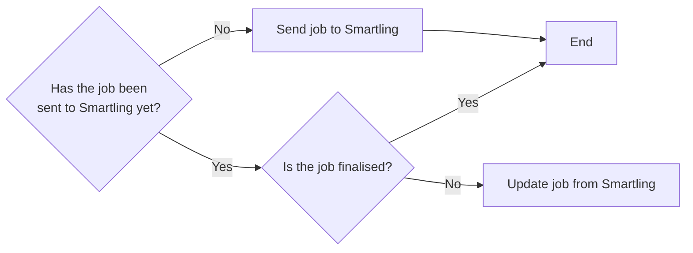

# Wagtail Localize Smartling

[](https://opensource.org/licenses/MPL-2.0)
[](https://badge.fury.io/py/wagtail-localize-smartling)
[](https://github.com/mozilla/wagtail-localize-smartling/actions/workflows/test.yml)

An extension for [Wagtail Localize](https://wagtail-localize.org/stable/) that
integrates with the Smartling translation platform.

## Links

- [Documentation](https://github.com/mozilla/wagtail-localize-smartling/blob/main/README.md)
- [Changelog](https://github.com/mozilla/wagtail-localize-smartling/blob/main/CHANGELOG.md)
- [Contributing](https://github.com/mozilla/wagtail-localize-smartling/blob/main/CONTRIBUTING.md)
- [Security](https://github.com/mozilla/wagtail-localize-smartling/security)
- [Smartling API documentation](https://api-reference.smartling.com/)

## Supported versions

- Python 3.8+
- Django 4.2+
- Wagtail 6.1+

## Installation

1. Install the package from PyPI:

    ```sh
    python -m pip install wagtail-localize-smartling
    ```

2. Add `"wagtail_localize_smartling"` to `INSTALLED_APPS` in your Django
    settings. Make sure it's before `"wagtail_localize"` and
    `"wagtail_localize.locales"`:

    ```python
    INSTALLED_APPS = [
        ...
        "wagtail_localize_smartling",
        "wagtail_localize",
        "wagtail_localize.locales",
        ...
    ]
    ```

3. Configure the plugin in your Django settings:

   ```python
    WAGTAIL_LOCALIZE_SMARTLING = {
        # Required settings (get these from "Account settings" > "API" in the Smartling dashboard)
        "PROJECT_ID": "<project_id>",
        "USER_IDENTIFIER": "<user_identifier>",
        "USER_SECRET": "<user_secret>",
        # Optional settings and their default values
        "REQUIRED": False,  # Set this to True to always send translations to Smartling
        "ENVIRONMENT": "production",  # Set this to "staging" to use Smartling's staging API
        "API_TIMEOUT_SECONDS": 5.0,  # Timeout in seconds for requests to the Smartling API
    }
    ```

    ----

    If your project's locales do not match those in Smartling (e.g. `ro` in your
    project, `ro-RO` in Smartling), then you can provide a Wagtail locale ID to
    Smartling locale ID mapping via the `LOCALE_TO_SMARTLING_LOCALE` setting:

    ```python
    WAGTAIL_LOCALIZE_SMARTLING = {
        "LOCALE_TO_SMARTLING_LOCALE": {
            "ro": "ro-RO"
        }
    }
    ```

    ... or you can specify a callable or a dotted path to a callable in the
    `LOCALE_MAPPING_CALLBACK` setting:

    ```python
    def map_project_locale_to_smartling(locale: str) -> str:
        if locale == "ro":
            return "ro-RO"
        return locale


    WAGTAIL_LOCALIZE_SMARTLING = {
        # ...
        "LOCALE_MAPPING_CALLBACK": "settings.map_project_locale_to_smartling"
    }
    ```

    The callback receives a `WAGTAIL_CONTENT_LANGUAGES` locale code string and is
    expected to return a valid mapped locale ID (or the original locale ID).

    Note that by default, when syncing translations the project will attempt to
    reformat a mixed-case, Smartling-style language code (e.g. `zh-CN`) into a
    Django-style all-lowercase code (e.g. `zh-cn`). Depending on how language
    codes are set up in your project, this behaviour may not be appropriate. You
    can disable it by settings the `REFORMAT_LANGUAGE_CODES` setting to `False`
    (the default is `True`):

    ```python
    WAGTAIL_LOCALIZE_SMARTLING = {
        # ...
        "REFORMAT_LANGUAGE_CODES": False
    }

    ```

    ----

    If you need to customize the default Job description, you can specify a callable or a dotted path to a callable in
    the `JOB_DESCRIPTION_CALLBACK` setting:

    ```python
    from typing import Iterable
    from wagtail_localize.models import Translation, TranslationSource

    def enhance_job_description(
        description: str,
        translation_source: TranslationSource,
        translations: Iterable[Translation]
   ) -> str:
        # note: to get the source instance, use translation_source.get_source_instance()
        return description + " my text."
    ```

    The callback receives the default description string, the job `TranslationSource` instance, and the list of
    target `Translation`s. It expected to return string.

    ----

    If you want to pass a [Visual Context](https://help.smartling.com/hc/en-us/articles/360057484273--Overview-of-Visual-Context)
    to Smartling after a Job is synced, you need to provide a way to get hold
    of the appropriate URL for the page to use context. You provide this via
    the `VISUAL_CONTEXT_CALLBACK` setting.

    If this callback is defined, it will be used to send the visual context to Smartling.
    This step happens just after the regular sync of a Job to Smartling and _only_ if
    the callback is defined.

    The callback must take the Job instance and return:

    1. a URL for the page that shows the content used to generate that Job
    2. the HTML of the page.

    ```python

    from wagtail.models import Page
    from wagtail_localize.models import Job
    from wagtail_localize_smartling.exceptions import IncapableVisualContextCallback

    def get_visual_context(job: Job) -> tuple[str, str]:

        # This assumes the page is live and visible. If the page is a
        # draft, you will need a some custom work to expose the draft
        # version of the page

        content_obj = job.translation_source.get_source_instance()

        # IMPORTANT: if your translatable objects include some where a visual
        # context is not available via a standalone, public URL (eg a Snippet,
        # rather than a Page), then your settings.VISUAL_CONTEXT_CALLBACK function
        # should raise IncapableVisualContextCallback with an explaination.

        # Below, we check if the object is a Page, but depending on how your objects
        # are previewable, you could use isinstance(content_obj, PreviewableMixin)

        if not isinstance(content_obj, Page):
            raise IncapableVisualContextCallback(
                "Object was not visually previewable"
            )

        page_url = page.full_url

        html = # code to render that page instance

        return page_url, html

    ```

    Note that if the syncing of the visual context fails, this will break the
    overall sync to Smartling, leaving an inconsistent state:
    there'll be a Job created in Smartling that's awaiting approval, but Wagtail
    will still think the job needs to be created. This, in turn, will mean we get
    duplicate job errors on the retry. Therefore, it is essential you have log
    handling set up to catch the `ERROR`-level alert that will happen at this point.

    ----

    By default, when translations for completed Jobs are imported into Wagtail,
    the system will send notification emails to anyone in the `Translation approver`
    Group, and also add a task list of items to (re)publish. You can disable these via
    the settings:
    - `SEND_EMAIL_ON_TRANSLATION_IMPORT`
    and
    - `ADD_APPROVAL_TASK_TO_DASHBOARD`
    respectively.

    The name of the `Translation approver` group is also a setting:
    `TRANSLATION_APPROVER_GROUP_NAME`, but be careful about changing
    this after the first deployment, as a data migration bootstraps the Group.

    You can also control how many tasks are shown on the dashboard
    via the `MAX_APPROVAL_TASKS_ON_DASHBOARD` setting.

4. Run migrations:

    ```sh
    ./manage.py migrate
    ```

## Setup

### Smartling project setup

For the plugin to work with a Smartling project, the Django/Wagtail internationalization- and localization-related settings must be compatible with the project's language settings:

- Only Wagtail content authored in the same language as the Smartling project's source language can be translated.
- Ideally, the language tags in [`WAGTAIL_CONTENT_LANGUAGES`](https://docs.wagtail.org/en/stable/reference/settings.html#wagtail-content-languages) should be the exact, case-insensitive matches for the Smartling projects target locales. For example, if your Smartling project targets `fr-FR`, then you must have `"fr-fr"` in your `WAGTAIL_CONTENT_LANGUAGES`, not just `"fr"`.
  However, if that is not possible, use the `LOCALE_TO_SMARTLING_LOCALE` or `LOCALE_MAPPING_CALLBACK` settings to map your Wagtail language codes to the Smartling language codes.

### Synchronization

The plugin provides a `sync_smartling` management command that:

- Creates jobs in Smartling for new content that's awaiting translation
- Checks the status of pending translation jobs
- Downloads and applies translations for completed jobs

This command should be set to run periodically via `cron` or similiar:

```sh
./manage.py sync_smartling
```

We recommend running this regularly, around once every 10 minutes.

### Callbacks

As well as the `sync_smartling` management command, the plugin sets the `callbackUrl` field on the Smartling jobs it creates to the URL of webhook handler view. This handler will proactively download and apply translations from completed jobs without waiting for the next `sync_smartling` run. This URL is based on the `WAGTAILADMIN_BASE_URL` setting, so it's important that's set and accessible from the internet.

> [!WARNING]
> Callbacks should not be relied on as the only method for downloading translations. Always make sure the `sync_smartling` command is run regularly to ensure your translations are up-to-date.

## Usage

### Submitting new content for translation
<!-- TODO -->

### Updating translations
<!-- TODO -->

## How it works
<!-- TODO -->

## Workflow

<!-- TODO make sure this is fleshed out properly -->

### Submitting pages for Smartling translation



### Smartling sync

`django-admin sync_smartling`, the below flowchart describes the logic run for each job



## Signals

This app provides two Signals.

`wagtail_localize.signals.individual_translation_imported` is sent each time a translation for a single locale (and for a single content object) is imported from Smartling.

Signal kwargs:

- `sender`: The `wagtail_localize_smartling.models.Job` class
- `instance`: The `Job` instance for which translation are being imported
- `translation`: The `wagtail_localize.models.Translation` instance the translations are being imported to.
  Use `translation.get_target_instance()` to get the model instance that the translation is for (e.g. a page or snippet)

`wagtail_localize.signals.translation_import_successful` is sent when all of the translations for a Job have been imported without issue.

Signal kwargs:

- `sender`: The `wagtail_localize_smartling.models.Job` class
- `instance`: The `Job` instance for which translation are being imported
- `translations_imported`: A list of `wagtail_localize.models.Translation` instances that were imported to for the entire Job.

## Cutting a new release

1. Bump the version in <https://github.com/mozilla/wagtail-localize-smartling/blob/main/src/wagtail_localize_smartling/__init__.py>
2. Update CHANGELOG.md
3. Commit and land the changes in main (via a PR, or committing to main if you're _sure_ this won't cause clashes)
4. Tag the release as `vX.Y.Z` on `main` – or make a tag via the GH UI in Step 6. (Remember to push up the new tag if you made it locally, with `git push --tags`)
5. Add a new Release via <https://github.com/mozilla/wagtail-localize-smartling/releases>
6. Select (or create) the new tag, add the title and description
7. Ensure the new Release is marked as latest (see checkboxes below the Release description)
8. Publish the new Release within GitHub - automation will take of the rest and push it up to PyPI
